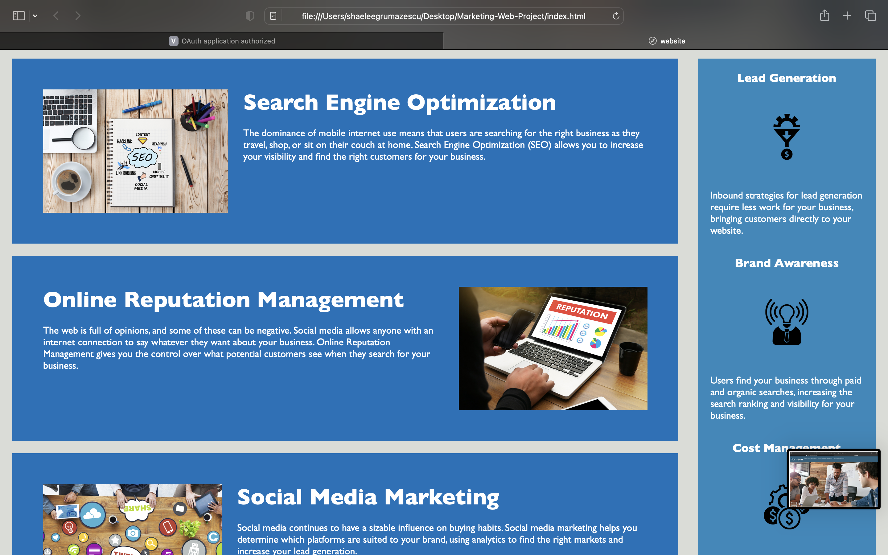
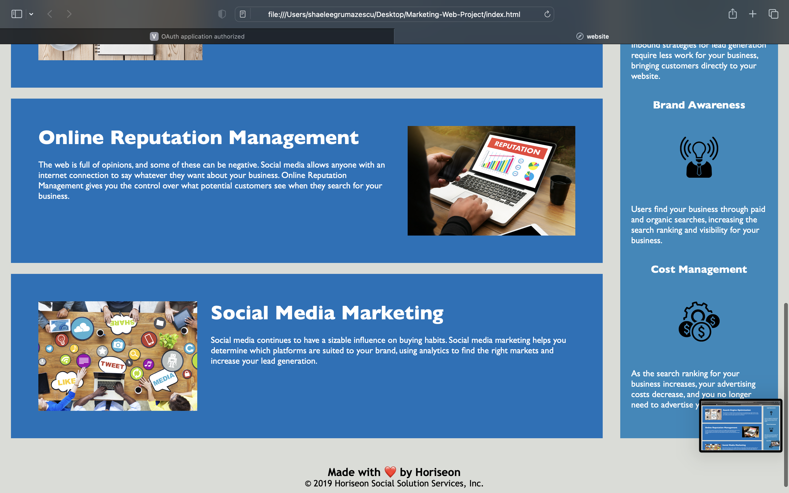

# Marketing-Web-Project

A more functinal website with updated HTML semantics and properly functioning CSS styling applied to become more user-friendly to the user browsing Horiseon marketing servicesl. 

##Table of Contents

-Description
-Installation
-Usage
-License

## Installation
Access this site by:
Step 1: Accessing Github Repository "Marketing-Web-Project" by owner ShaeGru16
Step 2: Heading to Pages
Step 3: Clicking live url

Or, access this live URL here:

## Usage 

'''md

'''
'''md

'''
'''md

'''

## License

MIT License.

Please refer to the associated license that can be viewed in the GitHub repository.

---
© 2022 Trilogy Education Services, LLC, a 2U, Inc. brand. Confidential and Proprietary. All Rights Reserved.